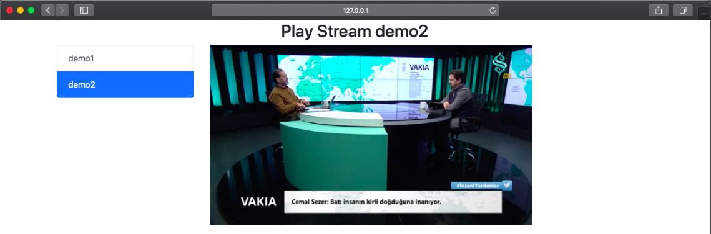

# RTSPtoWebRTC

RTSP Stream to WebBrowser over WebRTC based on Pion

full native! not use ffmpeg or gstreamer

if you need RTSPtoWSMP4f use https://github.com/deepch/RTSPtoWSMP4f

## Team

Deepch - https://github.com/deepch streaming developer

Dmitry - https://github.com/vdalex25 web developer

Now test work on (chrome, safari, firefox) no MAC OS



## Installation
1.
```bash
$ export GO111MODULE=on
$ go get github.com/deepch/RTSPtoWebRTC
```
2.
```bash
$ cd ~/go/src/github.com/deepch/RTSPtoWebRTC
```
3.
```bash
$ go run .
```
or
```bash
$ go build .
$ ./RTSPtoWebRTC
```
4.
```bash
open web browser http://127.0.0.1:8083 work chrome, safari, firefox
```

## Configuration

### Edit file config.json

format:

```bash
{
  "server": {
    "http_port": ":8083"
  },
  "streams": {
    "demo1": {
      "url": "rtsp://170.93.143.139/rtplive/470011e600ef003a004ee33696235daa"
    },
    "demo2": {
      "url": "rtsp://170.93.143.139/rtplive/470011e600ef003a004ee33696235daa"
    },
    "demo3": {
      "url": "rtsp://170.93.143.139/rtplive/470011e600ef003a004ee33696235daa"
    }
  }
}
```

## Limitations

Video Codecs Supported: H264

Audio Codecs Supported: pcm alaw and pcm mulaw 

[](https://www.paypal.me/AndreySemochkin) - You can make one-time donations via PayPal. I'll probably buy a ~~coffee~~ tea. :tea:
